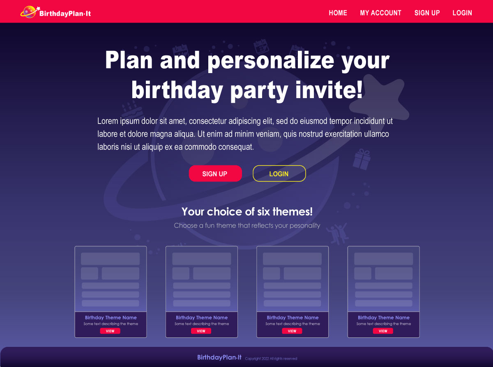

# Project Name
Birthday Plan It

## Project Summary

An app to plan your birthday party and track rsvp's.

## Developers

1. Madalyne Cross

2. Joshua Haddix

3. Ron Dronet

## Installation Instructions

- Clone our repo to your computer

- https://github.com/violanerd/birthday-plan-it

## Pictures of App

 

     

 
 

     

 
 

     

 

## Tech Stack

- What languages is it written with: 

- What libraries are used: 

- Other: 

## APIs

-

## MVP (Minimum Viable Product)

-

## Stretch Goals

-
