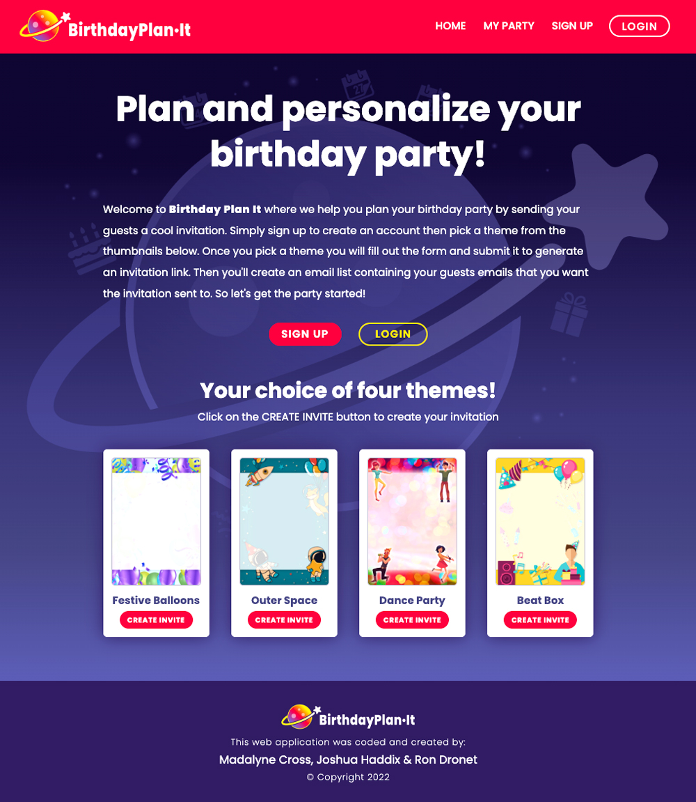

 

     

## **An app to plan and personalize your birthday party by creating a cool invitation and RSVP list. Let's get the party started!**

 

## **Purpose:**

Welcome to the Birthday Plan It app where we help you plan your birthday party by creating a cool invitation. Simply sign up to create an account then pick a theme from the thumbnails below. Once you’ve selected a theme you will fill out the form to create your invitation. Then you’ll create a list of email addresses to send the invite link to. Guests will be able to signup and rsvp to your party. On the My Party page you’ll then be able to see your rsvp list! 
 

## **Heroku App Link:**

## https://birthdayplanit.herokuapp.com/

 

## **Table of contents:**

- [Installation](#installation)
- [Start](#start)
- [Usage](#usage)
- [Contribute](#contribute)

 

     

 

 

## **Media Query Breakpoints:**
- 1200px
- 992px
- 768px
- 568px

 

## **This Full-stack App Was Created Using:**

### **The MERN Stack**
- MongoDB
- ExpressJS
- React
- NodeJS

 

## **Installation:**

### _To install all packages use this command in the the terminal:_

`npm i`

For development purposes, we used [Mailtrap.io](https://mailtrap.io/) to work with Nodemailer. Singup for an account and imput your credentials into the .env file for email functionality.

 

## **Start:**

### _To start, use this command in the the terminal then use http://localhost:3001/ in the browser:_

`npm run develop`

 

## **Usage:**

### The respository can be cloned and placed in a folder remotely.

 

## **Contribute:**

### Please contact us regarding contributing to this repository. All additions must be approved.

 

## **Contributing Programmers:**

### Madalyne Cross, Joshua Haddix & Ron Dronet

